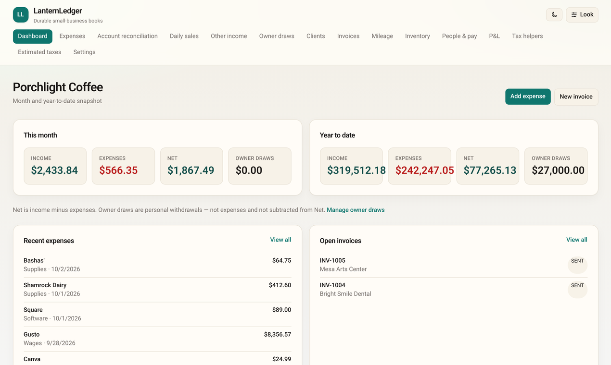
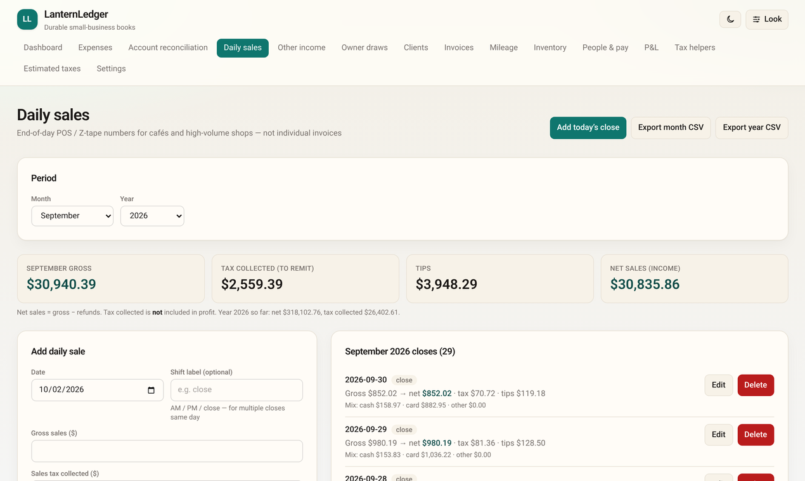
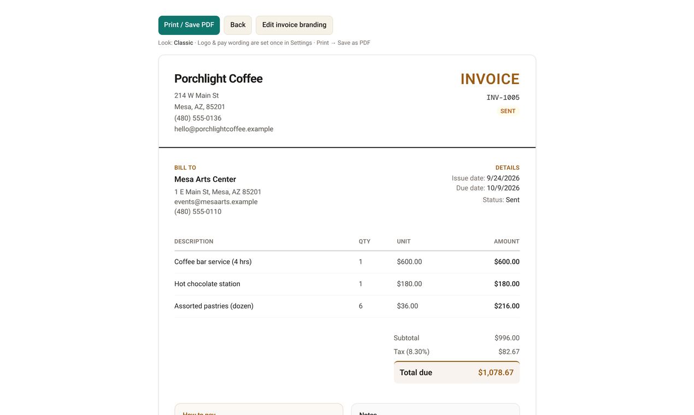
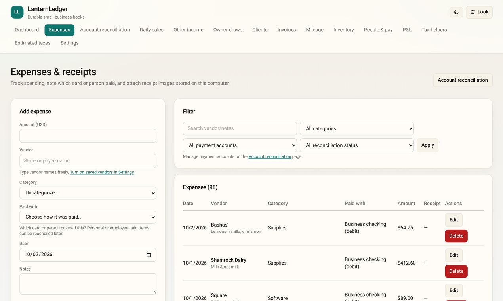
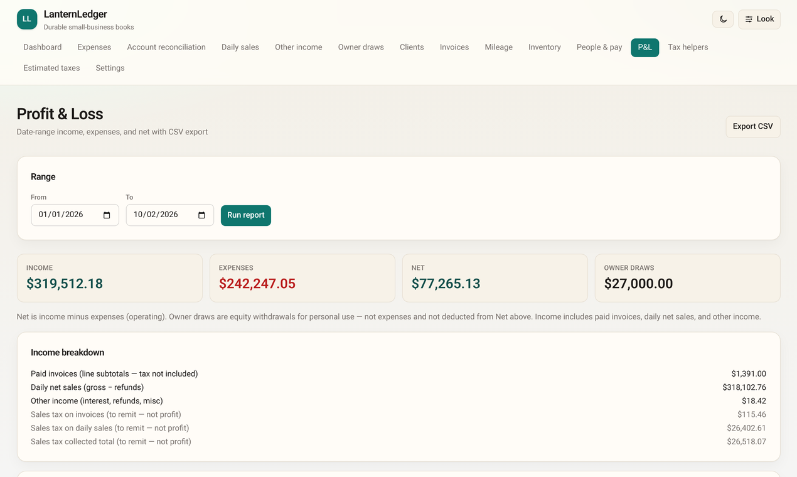
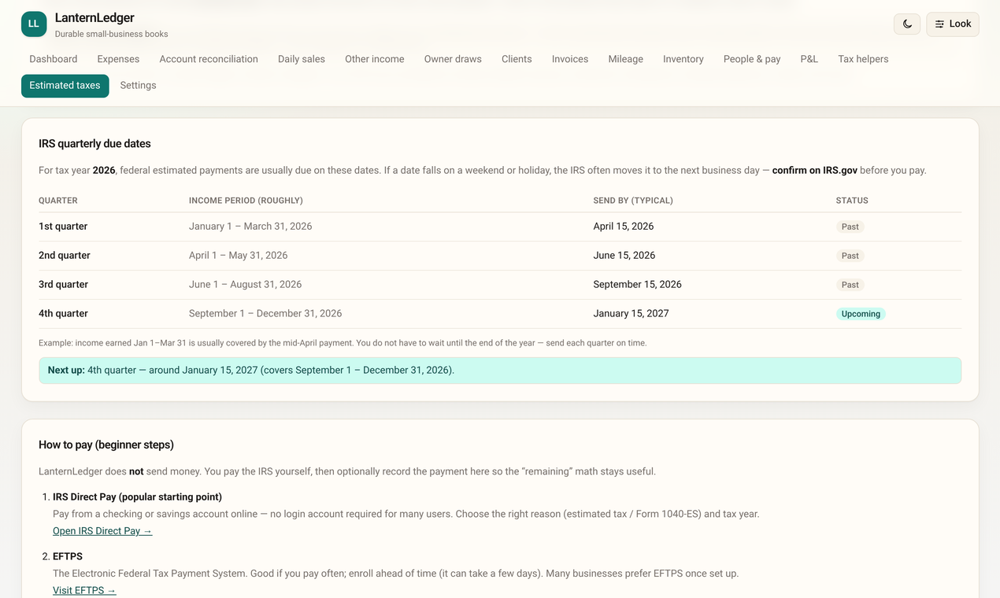
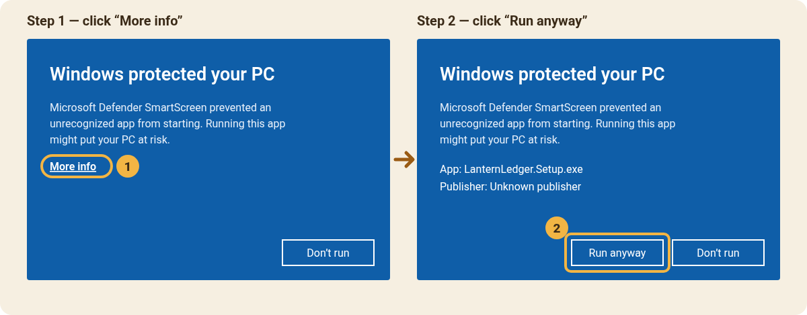

<p align="center">
  
</p>

<h1 align="center">LanternLedger</h1>

<p align="center"><strong>Free, simple bookkeeping for your small business — right on your Windows PC. No account, no subscription, no cloud.</strong></p>

<p align="center">
  <a href="https://github.com/mstidham345/LanternLedger/releases/latest"></a>
</p>

<p align="center">
  <a href="https://github.com/mstidham345/LanternLedger/releases/latest">Download</a> ·
  <a href="https://mstidham345.github.io/LanternLedger/">Website</a> ·
  <a href="#is-it-safe">Is it safe?</a> ·
  <a href="#windows-protected-your-pc">Install help</a> ·
  <a href="LICENSE">Terms of use</a>
</p>



LanternLedger is made for new sole proprietors, single-member LLC owners, and small shops like coffee shops, food trucks, salons, and makers. It keeps your books tidy in plain language, and your books never leave your computer.

## What it does

- **Daily sales** — type in your end-of-day register totals: sales, sales tax collected, tips, cash and card. Sales tax is kept separate so you know what you owe the state.
- **Invoices** — make clean, printable invoices with your logo, save them as PDF, and mark them paid.
- **Expenses & receipts** — log what you spend in tax-friendly categories and attach a photo of the receipt.
- **Mileage** — log business trips; the deduction uses the IRS rate for each trip’s date.
- **Contractors & 1099s** — record what you pay helpers and see who needs a 1099 at year end.
- **Owner draws** — track the money you take home, kept apart from business expenses.
- **Profit & loss** — money in, money out, and what’s left for any date range. Export it for your tax preparer.
- **Estimated taxes** — IRS quarterly due dates in plain English, how to pay, and a ballpark of what to set aside.
- **Automatic backups** — backup copies are made for you, and you can export or restore your books any time.

## Screenshots

*Shown with made-up books for “Porchlight Coffee.”*

| | |
|---|---|
|  **Dashboard** |  **Daily sales** |
|  **Invoices** |  **Expenses** |
|  **Profit & loss** |  **Estimated taxes** |

## Is it safe?

- **No account, no login.** There’s nothing to sign up for.
- **Your data never leaves your PC.** Your books are saved on your computer in `%APPDATA%\LanternLedger`. Nothing is uploaded anywhere, and uninstalling doesn’t delete your books.
- **Automatic backups.** LanternLedger makes backup copies while you work and keeps a daily copy for the last 30 days. You can also export a full copy to a USB drive or another folder.
- **Check the download yourself.** Every file has a unique fingerprint (a “SHA-256”). The fingerprint of `LanternLedger.Setup.exe` version 1.0.0 is:

  ```
  cbbe6d0980a3e43e9a3ac0005129e6ed0ff894accf82e820db81c931ff153644
  ```

  To compare: open your Downloads folder in File Explorer, click the address bar, type `powershell` and press Enter, then type `Get-FileHash .\LanternLedger.Setup.exe` and press Enter. The long number should match. For a second opinion, you can scan the file for free at [VirusTotal](https://www.virustotal.com/).

## “Windows protected your PC”

LanternLedger is made by one person and isn’t signed with a paid Microsoft certificate yet, so Windows shows a blue warning the first time you install it. That’s expected.

1. **Download** [LanternLedger.Setup.exe](https://github.com/mstidham345/LanternLedger/releases/latest). If your browser says the file “isn’t commonly downloaded,” choose **Keep** (in Edge: **…** → **Keep** → **Show more** → **Keep anyway**).
2. **Double-click** the file.
3. In the **“Windows protected your PC”** box, click **More info**.
4. Check that it says *App: LanternLedger.Setup.exe*, then click **Run anyway**.
5. Follow the installer. LanternLedger opens when it’s done and adds a desktop shortcut.



## System requirements

- Windows 10 or Windows 11, 64-bit
- About 500 MB of free disk space
- No internet needed to use it (only to download it and check for updates)

To update later: in the app, open **Settings → App updates → Check for updates**. Your books stay where they are.

## Questions

- **Is it free?** Yes — no trial, no subscription, no ads.
- **Is there a Mac version?** Not right now. Windows only.
- **Will it do my taxes?** No. The tax pages are guidance, not tax advice. Check important decisions with a CPA, enrolled agent, or the IRS.

## Support

- ☕ If LanternLedger helps your business, you can [buy me a coffee](https://buymeacoffee.com/lanternledger) — totally optional.
- ✉️ Questions, problems or ideas: [Mstidham345@gmail.com](mailto:Mstidham345@gmail.com)

## Terms of use

By downloading, installing, or using LanternLedger, you agree to the [Terms of use](LICENSE). LanternLedger is a bookkeeping tool only — not tax, legal, or accounting advice.
